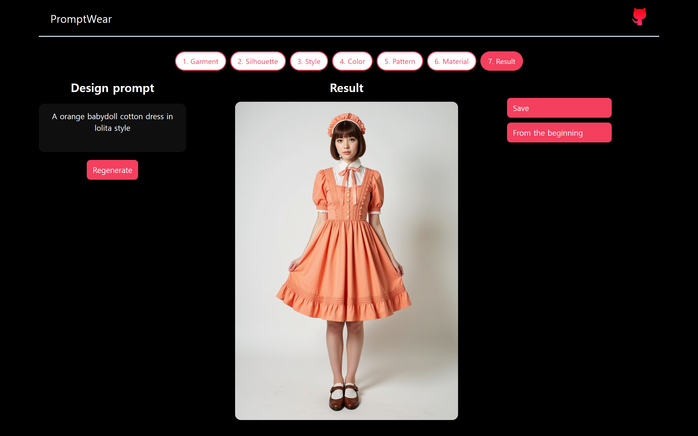

# PromptWear

PromptWear is a web-based AI assistant developed as part of a master’s thesis in Fashion Technology.  
The system is designed to support **beginner-level fashion design ideation** by transforming structured design inputs into AI-generated visual concepts.

Unlike fully automated design tools, PromptWear focuses on **creativity support**, helping users explore design directions, silhouettes, styles, and materials during the early ideation stage.

## Key Features

- Structured fashion design input system  
  (garment type, silhouette, style, material, color, pattern)
- AI-based image generation for visual ideation
- Prompt construction logic optimized for beginner designers
- Web-based interface for easy access and experimentation
- Supports exploratory and iterative design thinking rather than final design automation

---

## System Overview

PromptWear supports beginner-level fashion design ideation through a structured, step-by-step interaction workflow.  
The system guides users from defining design attributes to visually exploring AI-generated fashion concepts.

### Step 1: Design Input Interface

In the first step, users define key fashion design elements—such as garment type, silhouette, style, material, color, and pattern—through a structured web-based user interface.  
This interface is designed to reduce cognitive load for beginner designers by offering guided selections rather than free-form inputs.

---

### Step 2: Generated Result Page

After submitting the design inputs, the backend constructs a structured prompt and sends it to a diffusion-based image generation model via API.  
The system then displays AI-generated fashion design images that visualize the selected design direction.

This step allows users to evaluate visual outcomes and reflect on design coherence, proportions, and stylistic alignment.

---

### Step 3: Regeneration and Iterative Exploration

In the final step, users can modify selected design attributes and regenerate images to explore alternative variations.  
This iterative interaction supports exploratory design thinking by encouraging comparison and refinement rather than convergence on a single solution.

---

## Tech Stack

- Frontend: Vue.js
- Backend: FastAPI
- Image generation module: Stable Duffusion Forge UI API, diffusion model: Jib Mix Flux
